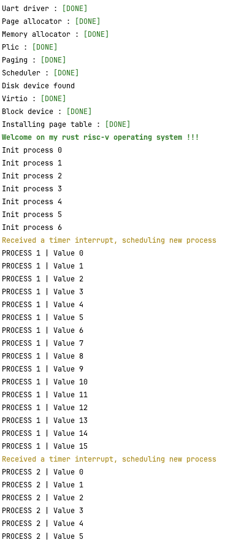

# My custom rust operating system

Rust operating system written for the risc-v architecture. Below is an example of the output.

### Currently this toy OS contains

- [X] Uart driver
- [X] Memory Allocation - a trivial allocator
- [X] Paging
- [X] Processes
- [X] A minimal virtio block driver
